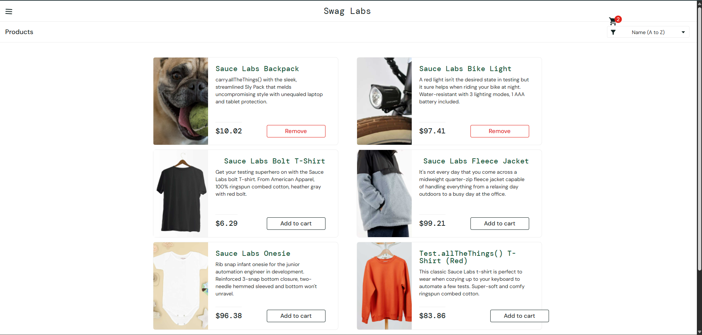
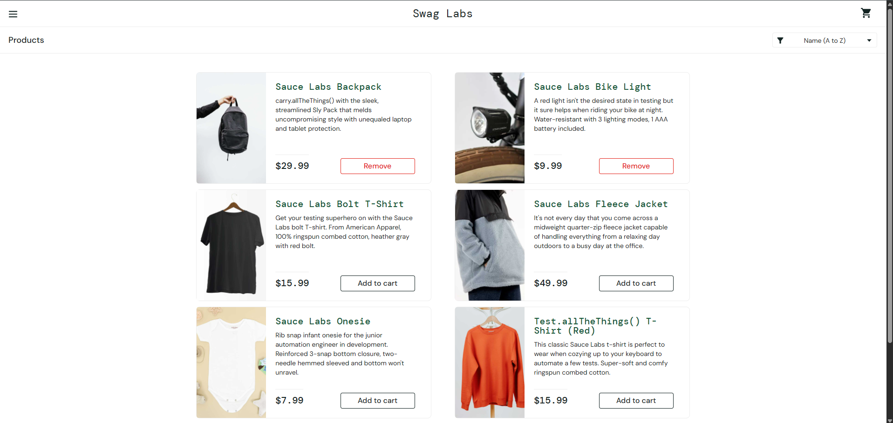
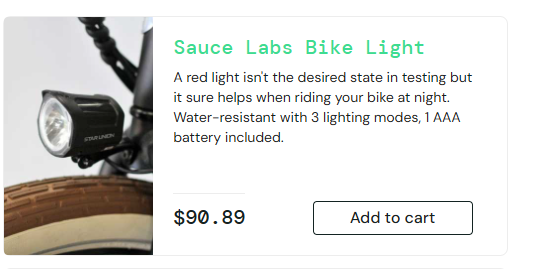
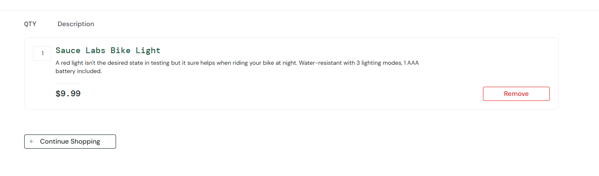
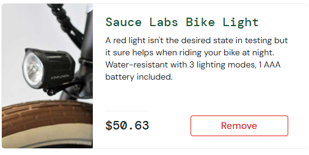
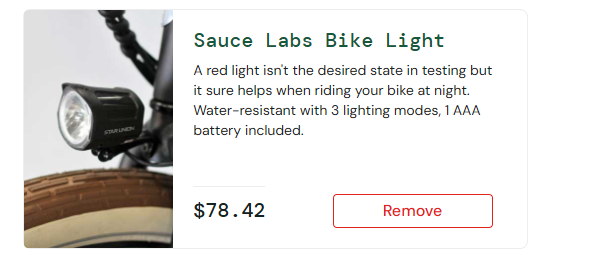
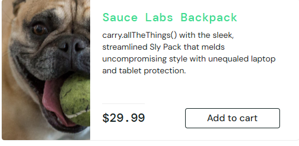
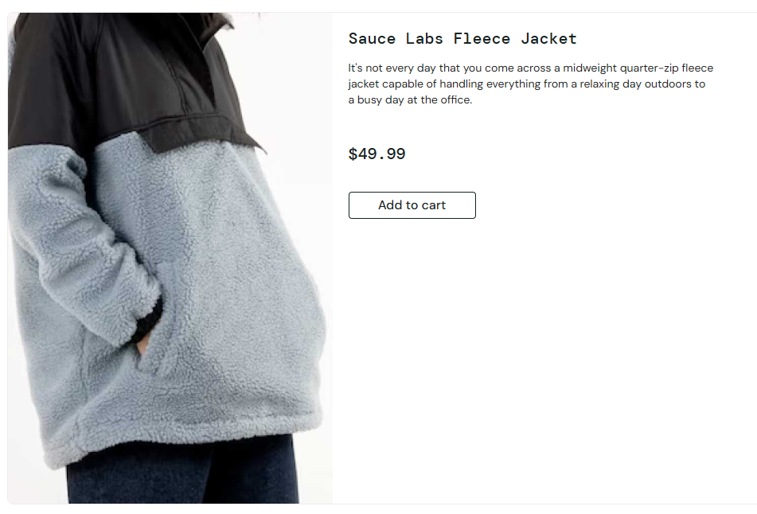
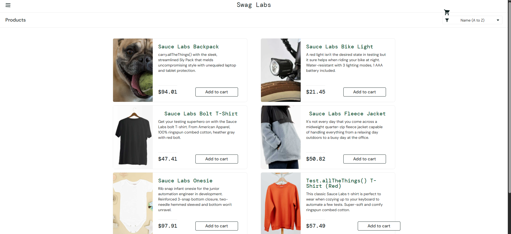

\# SauceDemo Bug Report

\## Test Environment

\- \*\*Operating System:\*\* Windows 11

\- \*\*Browser:\*\* Google Chrome 152.0.7977.76

\- \*\*Application:\*\* SauceDemo

## Context Note

SauceDemo provides special test accounts that exhibit different application behaviors. This report documents issues and abnormal behavior that I independently identified, reproduced, investigated, and classified during manual testing.

Some findings may represent intentionally seeded failure scenarios in the demo application rather than unknown production defects. They are documented here to demonstrate the testing, reproduction, investigation, and defect-reporting process.

## Defect Summary

| ID | Finding | Severity |
|----|---------|----------|
| BUG-01 | Cart contents persist after switching users | High |
| BUG-02 | Reset App State leaves product buttons in the Remove state | Medium |
| BUG-03 | Product prices are unstable and do not match cart prices for visual_user | High |
| BUG-04 | Selecting a product opens details for a different product for problem_user | High |
| BUG-05 | Remove button fails on Product Details page for problem_user | Medium |
| BUG-06 | Header elements are misaligned for visual_user | Low |
| BUG-07 | Cart link does not display pointer cursor on hover | Low |

\## BUG-01 — Cart Contents Persist After Logout and Login as a Different User

\*\*Severity:\*\* High  

\*\*Reproducibility:\*\* 3/3

\### Preconditions

\- A valid SauceDemo user is logged in.

\- At least one product has been added to the cart.

\### Steps to Reproduce

1\. Log in with a valid user account.

2\. Add one or more products to the cart.

3\. Log out.

4\. Log in with a different valid user account.

5\. Observe the cart badge and product buttons.

6\. Open the cart.

\### Expected Result

The newly logged-in user should start with an empty cart and the products should display their default `Add to cart` state.

\### Actual Result

The products selected by the previous user remain in the cart after the second user logs in. The corresponding products also remain in the `Remove` state. The newly logged-in user can remove the products left by the previous user.

### Evidence

Screenshot showing the persisted cart state observed after switching users:

\## BUG-02 — Reset App State Does Not Reset Product Buttons to "Add to cart"

\*\*Severity:\*\* Medium  

\*\*Reproducibility:\*\* 5/5  

\*\*User:\*\* standard\_user

\### Preconditions

\- `standard\_user` is logged in.

\- One or more products have been added to the cart.

\### Steps to Reproduce

1\. Open the application menu.

2\. Click `Reset App State`.

3\. Observe the cart badge.

4\. Observe the buttons for the previously selected products.

\### Expected Result

The cart should be cleared and previously selected products should return to their default `Add to cart` state.

\### Actual Result

The cart is cleared, but the previously selected products continue to display `Remove`. Refreshing the page restores the buttons to `Add to cart`. The behavior was reproduced with all products tested.

### Evidence

Screenshot showing the cart cleared while product buttons remained in the `Remove` state:

\## BUG-03 — Product Prices Are Unstable and Do Not Match Cart Prices for visual\_user

\*\*Severity:\*\* High  

\*\*Reproducibility:\*\* Consistently reproduced during repeated testing  

\*\*User:\*\* visual\_user

\### Preconditions

\- `visual\_user` is logged in.

\- The Products page is displayed.

\### Steps to Reproduce

1\. Locate `Sauce Labs Bike Light` on the Products page.

2\. Record the displayed price.

3\. Refresh the Products page and observe the price again.

4\. Repeat the refresh and compare the displayed prices.

5\. Add `Sauce Labs Bike Light` to the cart.

6\. Open the cart and compare its price with the price shown on the Products page.

\### Expected Result

The product price should remain consistent between page refreshes and the price displayed in the cart should match the price shown on the Products page.

\### Actual Result

The displayed price changed between repeated page loads. During captured testing, `Sauce Labs Bike Light` was displayed at different prices including `$90.89`, `$50.63`, and `$78.42`.

In the same tested flow, the product was displayed at `$90.89` on the Products page but appeared as `$9.99` in the cart.

### Evidence

Screenshots captured during repeated testing show the listing price changing between page loads and differing from the cart price.

**Products page — $90.89:**

**Cart — $9.99:**

**Products page after refresh — $50.63:**

**Products page after another refresh — $78.42:**

\## BUG-04 — Selecting a Product Opens Details for a Different Product for problem\_user

\*\*Severity:\*\* High  

\*\*Reproducibility:\*\* Consistently reproduced  

\*\*User:\*\* problem\_user

\### Preconditions

\- `problem\_user` is logged in.

\- The Products page is displayed.

\### Steps to Reproduce

1\. Locate `Sauce Labs Backpack` on the Products page.

2\. Observe the product name and price.

3\. Click the product to open its details page.

4\. Compare the displayed product details with the product selected.

\### Expected Result

The details page should display information for `Sauce Labs Backpack`, the product selected by the user.

\### Actual Result

The Products page displayed `Sauce Labs Backpack` at `$29.99`, but selecting it opened a details page for `Sauce Labs Fleece Jacket` at `$49.99`.

Additional exploratory testing with `problem\_user` showed broader product-catalog inconsistencies, including incorrect product images, mismatched product details, and a `Product Not Found` result for one product.

### Evidence

The following screenshots show the product selected from the Products page and the different product displayed after opening its details.

**Before — Sauce Labs Backpack displayed on Products page:**

**After selection — Sauce Labs Fleece Jacket displayed on Product Details page:**

\## BUG-05 — Remove Button Does Not Remove Product from Product Details Page for problem\_user

\*\*Severity:\*\* Medium  

\*\*Reproducibility:\*\* 3/3  

\*\*User:\*\* problem\_user

\### Preconditions

\- `problem\_user` is logged in.

\- A product has been added to the cart.

\- The Product Details page for the added product is displayed.

\### Steps to Reproduce

1\. Confirm that the product is currently in the cart.

2\. On the Product Details page, click `Remove`.

3\. Observe the cart badge and button state.

4\. Open the cart and verify whether the product was removed.

\### Expected Result

Clicking `Remove` should remove the product from the cart and update the product's button state.

\### Actual Result

Clicking `Remove` on the Product Details page does not remove the product. The cart state remains unchanged, and refreshing the page still displays the product in the `Remove` state.

Removing the same product from the Cart page works successfully. The equivalent removal action also worked correctly when tested with `standard\_user`.

### Evidence

The behavior was reproduced 3/3 during testing. Static screenshot evidence was not collected because a screenshot would not clearly demonstrate that clicking the button produced no action.

\## BUG-06 — Header Elements Are Misaligned for visual\_user

\*\*Severity:\*\* Low  

\*\*Reproducibility:\*\* 3/3  

\*\*User:\*\* visual\_user

\### Preconditions

\- `visual\_user` is logged in.

\- The Products page is displayed.

\### Steps to Reproduce

1\. Log in as `visual\_user`.

2\. Observe the header, menu button, and cart icon on the Products page.

3\. Compare their positioning with the same page when using `standard\_user`.

4\. Refresh the page and observe the layout again.

\### Expected Result

The header elements should maintain consistent alignment and spacing across user accounts.

\### Actual Result

For `visual\_user`, header elements are shifted from their normal positions and the cart icon appears unusually close to the product sorting control. The layout difference persists after refreshing the page and differs from the layout displayed for `standard\_user`.

No functional impact was observed.

### Evidence

Screenshot captured during testing showing the shifted header elements for `visual_user`:

\## BUG-07 — Cart Link Does Not Display Pointer Cursor on Hover

\*\*Severity:\*\* Low  

\*\*User:\*\* standard\_user

\### Preconditions

\- `standard\_user` is logged in.

\- The Products page is displayed.

\### Steps to Reproduce

1\. Move the mouse cursor over the cart icon/link in the header.

2\. Observe the cursor appearance.

3\. Compare it with other clickable controls on the page.

4\. Click the cart icon to confirm that it is interactive.

\### Expected Result

The cart link should provide hover feedback consistent with other clickable controls on the page, such as displaying a pointer cursor.

\### Actual Result

The cart link remains clickable and successfully opens the Cart page, but the cursor remains the normal arrow when hovering over it. Other tested clickable controls display a pointer cursor.

Chrome DevTools inspection confirmed that the cart element is implemented as an `<a>` element.

### Evidence

The behavior was observed during testing and verified using Chrome DevTools, which confirmed that the cart control is implemented as an `<a>` element.

Static screenshot evidence was not collected because a screenshot would not clearly demonstrate the hover cursor behavior.

\# Additional Observations

The following behaviors were investigated during exploratory testing but were not classified as confirmed defects.

\## Locked-Out User

`locked\_out\_user` was unable to log in and consistently received:

> Epic sadface: Sorry, this user has been locked out.

The behavior persisted across repeated attempts, while other valid users could log in successfully. Because the username and error message explicitly indicate that the account is intended to be locked, this was treated as expected behavior rather than a defect.

\## Performance Glitch User

`performance\_glitch\_user` consistently loaded the application noticeably slower than `standard\_user`.

Chrome DevTools Network analysis did not indicate a comparable network delay. Performance analysis showed approximately 5 seconds of scripting activity during the delayed load. The application eventually loaded and remained functional.

Because the account is explicitly named `performance\_glitch\_user`, the behavior was documented as an observation rather than reported as an unexpected defect.

\## About Page — 403 Response

Selecting `About` redirected the browser to `saucelabs.com`, which returned `403 Forbidden`.

The destination produced the same result when accessed directly, while logged out, and in other browser contexts. The SauceDemo navigation itself successfully redirected to the external destination, so the behavior was not classified as a confirmed SauceDemo defect.

\## Terms of Service and Privacy Policy

The footer displays `Terms of Service` and `Privacy Policy`, but neither text is interactive.

Chrome DevTools inspection showed that the text is contained within a footer `
` and is not implemented using `<a>` elements or `href` attributes. Without a requirement establishing that these items should be links, they were retained as observations rather than confirmed defects.

\## Browser Back/Forward and Authentication State

While authenticated, pressing browser Back once from the Products page displayed the Login page without explicitly logging out. Pressing Forward returned to the authenticated Products page without requiring authentication again. This behavior was reproduced 3/3.

In additional testing, a different valid user could log in from the displayed Login page without the first user explicitly logging out. The second login replaced the active user, and subsequent Back/Forward navigation remained associated with the newly authenticated user.

No authentication bypass or simultaneous access to both user states was demonstrated, so this was documented as a navigation/session-history observation rather than a security defect.

